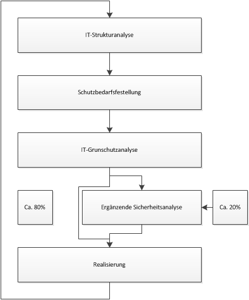

<!-- $size: 16:9 -->
<!-- $theme: gaia -->
<!-- template: invert -->
<!-- page_number: true -->

Datenschutz WS16/17
===
## Tools für Informationssicherheit

---
# Agenda

* Vorstellung
* Bundesamt für Sicherheit in der Informationstechnik
* Information Security Management System
* DIN ISO/IEC 27001/27002
* IT-Grundschutz
   * IT-Grundschutzvorgehensweise
   * Bausteinkatalog
* Datenschutz im IT-Grundschutz

---
# $whoami
* ==Fabian Langer==
  * Studiengang: IT-Sicherheit
  * ehemals studentische Hilfskraft bei KPMG
     * Entwicklung von Tools zum Umgang mit ISMS
* ==Tobias Moritz Gruber==
   * Studiengang: IT-Sicherheit
   * studentische Hilfskraft bei der admeritia GmbH
     * Penetrationtests und Entwicklung von Verfahren für ISMS   

---
# Bundesamt für Sicherheit in der Informationstechnik
* Gründung: ==1991==
* Anzahl der Bedienstete: 600 
* gehört zum ==Bundesministerium des Innern==
  * häufige Kritik, da das BSI nicht unabhängig ist
* keine ==offensiven== Kompetenzen
  * Schutz des Staates der Wirtschaft und der Gesellschaft
  * häufige Kritik bezüglich des Code-Audits des Bundestrojaners
---
# Information Security Management System
* Informationssicherheit enthält ==alle Aspekte der IT-Sicherheit==
* Ein ISMS umfasst folgende Punkte der Informationssicherheit:
  * Einrichtung
  * Implementierung
  * Betrieb
  * Überwachung
* Aufstellung von Verfahren, um die Informationssicherheit in einem Unternehmen zu definieren und zu steuern

---
# DIN ISO/IEC 27001/27002
* Norm zur ==Bewertung== der Informationssicherheit
  * zweiteilig (ISO/IEC 27001 und ISO/IEC 27002)
* ISO/IEC 27001 beschreibt ==Anforderungen an die Umsetzung und Dokumentation== eines ISMS
  * Prüfgrundlage
* ISO/IEC 27002 gibt Vorschläge zur Implementierung eines ISMS
  * enthält ==Best-Practices==
  * nicht technisch, sowie nicht konkret
* IT-Grundschutz ist ==kompatibel== zur ISO/IEC 27001/27002

---
# IT-Grundschutz
* seit 1994: IT-Grundschutzhandbuch== 
* ==Empfehlungen für Standardsicherheitsmaßnahmen==
* Maßnahmen zur Sicherung betreffen folgende Bereiche
	* Organisationstruktur
	* Personal
	* Infrastruktur
	* Technik

---
* seit ==2005 Umstrukturierung== und Umbennung in IT-Grundschutzkatalog
* umfasst nur noch
	* Baustein-
	* Maßnahmen-
	* Gefährdungskataloge
* Erweiterung um Managementsysteme für Informationssicherheit (BSI-Standard 100-1)
* Vorgehensweise aus GSHB wurde ein eigenes Dokument (BSI-Standard 100-2)
* EBSrweiterung um Risikoanalyse auf der Basis von IT-Grundschutz (BSI-Standard 100-3)
* Erweiterung um Notfallmanagement (BSI-Standard 100-4)

---
# IT-Grundschutzvorgehensweise
* IT-Sicherheitsmanagement in der Praxis
* ==Erstellung von Sicherheitskonzepten==
* ==ausreichendes== IT-Sicherheitsniveau für Systeme mit ==normalem Schutzbedarf==
* ==fünfstufiges Konzept==
* IT-Grundschutz Vorgehen:
	* Zusammenstellung der erfordelichen Maßnahmen
	* bei erhöhtem Schutzbedarf ist eine ergänzende Sicherheitsnalyse notwendig

---
# IT-Grundschutzvorgehensweise

-

---
# Schritt 1: IT-Strukturanalyse
* Informationen beschaffen:
	* Netzplan
	* tabelarisches Register der IT-Systeme
	* tabelarisches Register der Software
	* Erfassung der Räume in denen IT-Systeme stehen
* Gruppenbildung bei Systemen/Software mit
	* gleichem Typ
	* gleicher Konfiguration
	* gleicher Anbindung

---
# Schritt 2: Schutzbedarfsfeststellung
* Grundwerte der Bewertung
  * Vertraulichkeit
  * Integrität
  * Verfügbarkeit
* Bewertung anhand ==dreier Schutzbedarfskategorien==
* Abstimmung mit Anwendern und Fachabteilungen
* bei mehreren Anwendungen auf einem System gilt das Maximums-Prinzip

---

| Schutzbedarfskategorien |                                                                                        |
|-------------------------|----------------------------------------------------------------------------------------|
| normal                  | Schadensauswirkungen sind begrenzt und überschaubar                                    |
| hoch                    | Schäden können beträchtlich sein                                                       |
| sehr hoch               | Schadensauswirkungen können existentiell bedrohliches, katastrophales Ausmaß erreichen |

---
# Schritt 3: IT-Grundschutzanalyse
* andwendbar für Systeme mit ==normalem== Schutzbedarf
* Abgleich der IT-Struktur mit dem Bausteinkataloge
  * ==Nachbildung der IT-Struktur über einzelne Bausteine==
  * ==Soll-Ist-Abgleich== der Systeme
    * nicht jede Maßnahme muss umgesetzt werden
    * es muss aber ==dokumentiert== werden warum nicht
* in Schritt fünf erfolgt die ==Realisierung der Maßnahmen==

---
# Schritt 4: Ergänzende Analyse

* nur bei einer Schutzbedarfskategorie von ==hoch== oder ==sehr hoch==
* bekannte Beispiele:
  * sensible Industriesteuerungen
  * Systeme auf denen Geschäftsgeheimnisse gespeichert sind
* ==BSI-Standard 100-3== beschreibt eine Methodik zur Analyse der Objekte

---
# Bausteinkataloge
* aktuelle Version: IT-Grundschutz-Kataloge 15.Ergänzungslieferung - 2016
* ==5082 Seiten==
* Ein Baustein ist dabei ein ==Thema==, welches beschreibt, wie ein Objekt ==Gefährdungen== ausgestzt ist und welche ==Maßnahmen== davor schützen können
* Bausteine gehören zu einer der folgenden Kategorien
  * übergreifende Aspekte
  * Infrastruktur
  * IT-Systeme
  * Netze
  * Anwendungen

---
# B 1.5. Datenschutz
* beschreibt allgemeine und rechtliche Aspekte des Themas Datenschutz
* beschreibt in Grundzügen das BDSG
* Gefährdungslage:
  * unzureichende Datensparsamkeit
  * fehlende Transparenz für die Betroffenen
  * Verletzung des Datengeheimnisses bei der Verabeitung von pers. Daten
---
# B 1.5. Datenschutz
* Maßnahmen zur Gewährung des Datenschutzes
  * Unterrichtung der Mitarbeiter bei der Verabeitung von pers. Daten
  * Regelung beim Abruf von pers. Daten
---
# B 2.12. IT-Verkabelung
* Einführung in das Thema
* Gefährdungslage:
  * Kabelbrand
  * unzulässige Kabelverbindung
  * unzureichende Leistungskapazitäten
* Maßnahmen zur Sicherung der Verkabelung
  * Auswahl geeigneter Kabeltypen
  * Auswahl geeigneter Netzwerktopologie
  * Entfernen nicht benötigter Leitungen

---
# B 3.101. Server unter Unix
* Einführung in das Thema
* Unix wird hier als Oberbegriff für alle Unix Betriebsysteme genutzt
  * wie BSD, Linux, Solaris, etc.
* Gefährdungslage:
  * fehlerhafte Konfiguration von sendmail
  * Hijacking von Netzwerkverbindungen
* Maßnahmen:
 * aktivieren von Loging-Diensten
 * deaktivieren nicht benötigter Netzdienste
 
 ---
# B 4.4. VPN
* Beschreibung der Funktion eines VPN und dessen Typen
* Gefährdungslage:
  * unsichere kryptografische Algorithmen
  * fehlerhafte Zugangsberechtigungen
  * Ausfall von VPN-Verbindungen
* Maßnahmen zur Sicherung von VPN-Verbindungen:
  * geeigente Auswahl von VPN-Produkten
  * Bildung von Teilnetzen
  * Sichere Konfiguration eines VPNs
---
# B 5.18. DNS-Server
* Beschreibung der Funktion des DNS-Protokols
* Gefährdungslage:
  * unzureichende Leitungskapazität
  * fehlerhafte Konfiguration eines DNS-Servers
  * DNS-Spoofing
* Maßnahmen zur Sicherung von DNS-Servern:
  * Einsatz eines minimalen Betriebsystems
  * sichere Konfiguration des DNS-Servers
  * Vergabe von Zugriffsrechten
---
# Quellen
* https://download.gsb.bund.de/BSI/ITGSK/IT-Grundschutz-Kataloge_2016_EL15_DE.pdf
* https://www.bsi.bund.de/DE/Themen/ITGrundschutz/itgrundschutz_node.html https://www.bsi.bund.de/DE/Themen/ITGrundschutz/ITGrundschutzSchulung/WebkursITGrundschutz/Modellierung/Bausteine/bausteine_node.html
* https://www.heise.de/newsticker/meldung/Geheimpapiere-BSI-entwickelte-Bundestrojaner-mit-2577582.html
* http://www-brs.ub.ruhr-uni-bochum.de/netahtml/HSS/Diss/KlemptPhilipp/diss.pdf
*
---
# Vielen Dank
## Fragen?
